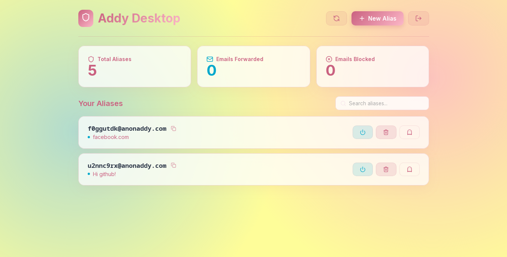

# Addy Desktop



A lightweight Linux desktop client for [addy.io](https://addy.io) (formerly AnonAddy), built with Tauri and React.

## About addy.io

addy.io is an open-source email forwarding service that allows you to protect your real email address. It enables you to create unlimited email aliases, which forward messages to your real inbox. This protects you from spam, prevents cross-site tracking, and gives you total control over who can reach your inbox.

## Features

- **Dashboard Statistics:** View account usage and forwarding/blocking stats.
- **Alias Management:** List, toggle active status, delete, or forget aliases.
- **Alias Creation:** Generate new aliases with custom descriptions and domains.
- **System Keyring Integration:** Securely stores your API key using your system's native secret storage (GNOME Keyring, KWallet, etc.).
- **System Tray Integration:** Quick access from the system panel.
- **Clean Interface:** Modern, efficient UI with Tailwind CSS.

## Prerequisites (Linux)

For secure API key storage, this application requires a Secret Service provider to be running on your system.

- **GNOME/XFCE/MATE:** Usually provided by `gnome-keyring`.
- **KDE Plasma:** Usually provided by `kwallet`.
- **Arch Linux (Minimal):** Install `gnome-keyring` and `libsecret`:
  ```bash
  sudo pacman -S gnome-keyring libsecret
  ```

## How to Get Your API Key

1. Log in to [app.addy.io](https://app.addy.io).
2. Go to [Settings > API Keys](https://app.addy.io/settings/keys).
3. Create a new token and copy it.
4. Paste it into the application's login screen.

## Development

1. Install dependencies:
   ```bash
   npm install
   ```
2. Run in development mode:
   ```bash
   npm run tauri dev
   ```
3. Build for production:
   ```bash
   npm run tauri build
   ```

## License

This project is open-source.
